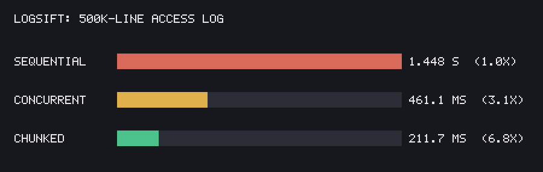
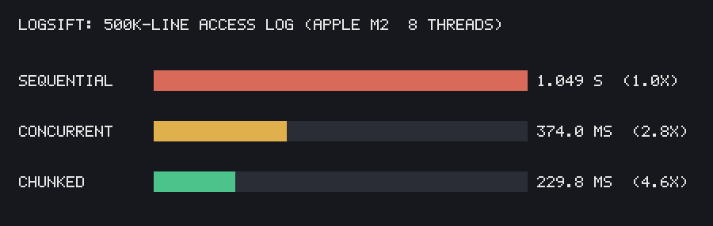
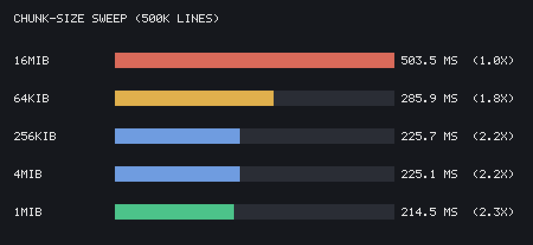

# logsift

A fast, concurrent command-line tool for parsing and summarizing
[Common Log Format](https://en.wikipedia.org/wiki/Common_Log_Format)-style web
access logs. Point it at a log file and it reports total traffic, status-code
breakdowns, and the busiest paths — chewing through a ~59 MB / 500k-line log in
about a quarter of a second.

Written in pure Go with **zero third-party dependencies** (standard library
only).

## Install

```sh
go build -o logsift .
# or run without building:
go run . --file access.log
```

## Usage

```sh
logsift --file <path> [--input-format combined|json] [--format table|text|json] [--workers N]
```

| Flag             | Default            | Description                                                    |
| ---------------- | ------------------ | ------------------------------------------------------------- |
| `--file`         | *(required)*       | Path to the log file to analyze.                              |
| `--input-format` | `combined`         | Input log format: `combined` (regex) or `json` (Caddy-style). |
| `--format`       | `table`            | Output format: `table`, `text`, or `json`.                    |
| `--workers`      | `runtime.NumCPU()` | Number of parser goroutines.                                  |
| `--chunk-size`   | `1MiB`             | Block size for the reader (e.g. `256KiB`, `1MiB`, `4MiB`).    |

### Example

```sh
$ logsift --file access.log
METRIC       VALUE
Total lines  500000
Bad lines    1
Total bytes  1623847291

STATUS  COUNT
200     412043
301     12871
404     61092
500     13993

PATH            COUNT
/api/users      98211
/api/orders     74553
/login          51002
...
```

`--format json` emits the complete stats object (every path, not just the top
10), which is handy for piping into `jq` or another tool.

## Expected log format

With `--input-format combined` (the default), each line is matched against the
combined log format:

```
127.0.0.1 - - [10/Oct/2025:13:55:36 -0700] "GET /api/users HTTP/1.1" 200 1534 "https://example.com" "Mozilla/5.0"
```

With `--input-format json`, each line is a nested [Caddy-style](https://caddyserver.com/docs/caddyfile/directives/log)
JSON access-log object (one JSON object per line, `time_format: rfc3339`):

```json
{"ts":"2025-10-10T13:55:36Z","request":{"remote_ip":"127.0.0.1","proto":"HTTP/1.1","method":"GET","uri":"/api/users","headers":{"User-Agent":["Mozilla/5.0"],"Referer":["https://example.com"]}},"status":200,"size":1534}
```

Either way, lines that don't match (or JSON that's malformed or missing required
fields) are counted under **Bad lines** rather than aborting the run, so a few
malformed entries won't stop you from analyzing the rest.

## How it works

```
file ──▶ readBlocks ──▶ jobs chan ──▶ N workers ──▶ results chan ──▶ Merge ──▶ output
         (1 MiB blocks)              (parse + aggregate,
                                      one local Stats each)
```

The file is read in fixed 1 MiB blocks. Each block is split on the last newline
so workers only ever see complete lines; the trailing partial line is carried
over and glued onto the front of the next block. Every worker aggregates into
its **own** `Stats` (no shared state, no locks), and the per-worker results are
merged at the end. See [`internal/pool/largefile.go`](internal/pool/largefile.go).

### Project layout

| Path                       | Responsibility                                            |
| -------------------------- | --------------------------------------------------------- |
| `main.go`                  | Flag parsing and wiring.                                  |
| `internal/parser`          | Parse one log line into a `LogEntry` (`Parse` = regex/combined, `ParseJSON` = JSON). |
| `internal/aggregator`      | Accumulate and merge `Stats`.                             |
| `internal/pool`            | Concurrency strategies (`Run`, `RunChunked`).             |
| `internal/output`          | Render `Stats` as table / text / JSON.                    |
| `tools/benchplot`          | Turn `go test -bench` output into a chart (see below).    |

## Benchmarks

Three strategies are benchmarked against the same 500k-line / ~59 MB log:

- **Sequential** — a single goroutine, line by line (the baseline).
- **Concurrent** — a worker pool, one line per channel send.
- **Chunked** — a worker pool fed whole 1 MiB blocks, turning millions of tiny
  channel sends into a few thousand big ones.

```
logsift: 500k-line access log (AMD Ryzen 7 3700X, 16 threads)

  Sequential  ████████████████████████████████████████████    1.636 s  (1.0x)
  Concurrent  ████████████································   460.4 ms  (3.6x)
  Chunked     ██████······································   240.3 ms  (6.8x)
```



```
logsift: 500k-line access log (Apple M2, 8 threads)

  Sequential  ████████████████████████████████████████████    1.049 s  (1.0x)
  Concurrent  ████████████████····························   374.0 ms  (2.8x)
  Chunked     ██████████··································   229.8 ms  (4.6x)
```



> Each chart's speedups are relative to *that machine's* own sequential run.
> Your numbers will differ; run it yourself with the commands below.

The same byte-identical fixture (`tools/createlargefile`, fixed seed) runs on
both, so this is a fair cross-machine read:

| Strategy   | Ryzen 7 3700X (16t) | Apple M2 (8t) | M2 ÷ Ryzen |
| ---------- | ------------------- | ------------- | ---------- |
| Sequential | 1.636 s             | 1.049 s       | 0.64×      |
| Concurrent | 460.4 ms            | 374.0 ms      | 0.81×      |
| Chunked    | 240.3 ms            | 229.8 ms      | 0.96×      |

Two stories sit on top of each other. **Single-core**, the M2 is far ahead — its
sequential run is 0.64× the Ryzen's wall time (~1.6× faster per line). **Scaling**,
the Ryzen pulls back: 16 threads take chunked to 6.8× over its own baseline,
while the M2's 8 cores manage 4.6×. The two effects nearly cancel — the M2's
stronger cores almost exactly offset the Ryzen's thread count, landing both at
~230–240 ms chunked (M2 still a hair ahead, 0.96×).

### Why chunked wins

Both `Concurrent` and `Chunked` run the *same* per-line parser in parallel — the
difference is the unit handed across the channel. `Concurrent` sends one line
per channel op (~500k tiny synchronized handoffs) and splits every line on the
single producer goroutine. `Chunked` sends one ~1 MiB block (~10k lines) per op
(~50 handoffs) and pushes the line-splitting *into* the parallel workers. Fewer
handoffs plus more parallelized work is the whole speedup.

### Combined vs JSON parsing

The combined parser runs one compiled regex over a line and pulls fields out by
position. The JSON parser (`encoding/json`) instead matches struct tags onto a
nested struct via **reflection** at runtime, and copies the line into a fresh
`[]byte` to decode. Reflection plus those extra copies cost real time — measured
on the *same* logical record (`BenchmarkParse*`) on two machines:

```
parser microbench (one record, in-memory — shared scale)

  M2    Parse (combined)  █████████████████···························  1980 ns   3 allocs
  M2    ParseJSON         █████████████████████████···················  2928 ns  19 allocs
  Ryzen Parse (combined)  ██████████████████████████··················  3077 ns   3 allocs
  Ryzen ParseJSON         ████████████████████████████████████████████  5164 ns  19 allocs
```

All four bars share one scale (longest = the slowest, Ryzen `ParseJSON`), so
they're directly comparable: the M2 is faster on *both* parsers (shorter bars),
and within each machine JSON is the longer bar.

| Parser                | M2 (ns/op) | Ryzen 7 3700X (ns/op) | allocs/op | B/op |
| --------------------- | ---------- | --------------------- | --------- | ---- |
| Parse (combined)      | 1980       | 3077                  | 3         | 466  |
| ParseJSON             | 2928       | 5164                  | 19        | 1160 |
| **JSON ÷ combined**   | 1.48×      | 1.68×                 | 6.3×      | 2.5× |

The absolute per-record cost is higher on the Ryzen — the M2's single core is
just faster at this work — but the *shape* of the result is identical on both:
JSON is ~1.5–1.7× slower per record and does **6× the allocations**. Those
alloc/byte figures (3 vs 19 allocs, 466 vs 1160 B) come straight from the code
path, so they don't move between machines; only the wall-clock `ns/op` does. A
good reminder that "just use `encoding/json`" isn't free. The fix, if the JSON
path ever became the hot path, is a faster decoder (`goccy/go-json`, `jsoniter`)
or hand-rolled field extraction. Compare end-to-end with `ns/line`, not raw
`ns/op` or `MB/s`: the two fixture files differ in size and line length, so only
the per-line figure is apples-to-apples.

### Tuning the block size

`--chunk-size` controls that block. It's a trade-off, not a "bigger is better"
knob: too small and you pay per-send overhead; too large and there aren't enough
blocks to keep every worker busy, so the slowest one becomes a straggler at the
tail. The sweep below (16 threads) shows the sweet spot sits around 1–4 MiB:

```
chunk-size sweep (500k lines)

  16MiB   ████████████████████████████████████████████   506.3 ms  (1.0x)
  64KiB   ███████████████████████████·················   308.8 ms  (1.6x)
  256KiB  ██████████████████████······················   254.4 ms  (2.0x)
  4MiB    ████████████████████························   231.2 ms  (2.2x)
  1MiB    ████████████████████························   229.6 ms  (2.2x)
```



Run the sweep yourself:

```sh
go test -bench=BenchmarkChunkedSizes -benchmem -run='^$' -count=1 .
```

### Reproducing

The benchmark fixtures are generated (not checked in). Create them first:

```sh
go run ./tools/createlargefile -count 500000 -seed 42 -out testdata/big.log
python3 tools/genjson.py --out testdata/logs.jsonl --size 50MiB --seed 42
```

Both generators are **seeded**, so these commands produce byte-identical
fixtures on any machine (`big.log` → ~59 MB, sha256 `29ba09de…`). That's what
makes the cross-machine numbers a fair comparison — everyone parses the exact
same bytes.

Then run the benchmarks:

```sh
go test -bench=. -benchmem -run='^$' -count=1 .
```

### Rendering the chart

[`tools/benchplot`](tools/benchplot) reads `go test -bench` output on stdin,
prints the Unicode bar chart above, and can optionally write a PNG. It uses only
the standard library (`image`/`image/png` with a hand-rolled bitmap font), so it
adds no dependencies.

```sh
# ASCII chart to the terminal:
go test -bench=. -run='^$' -count=1 . | go run ./tools/benchplot

# ...and a PNG image:
go test -bench=. -run='^$' -count=1 . | \
  go run ./tools/benchplot -title "logsift: 500k-line access log" -png bench.png
```

| Flag      | Default              | Description                          |
| --------- | -------------------- | ------------------------------------ |
| `-png`    | *(off)*              | Also write a PNG bar chart here.     |
| `-title`  | `logsift benchmarks` | Chart title.                         |
| `-width`  | `44`                 | Width of the ASCII bars, in chars.   |

## Testing

```sh
go test ./...
```

The chunked reader is tested with deliberately tiny block sizes (1, 3, 7 bytes)
to force lines — and even single fields — to straddle block boundaries, which is
the easiest part of the streaming logic to get wrong.
